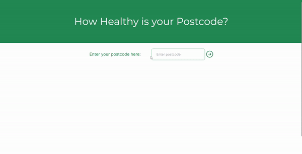
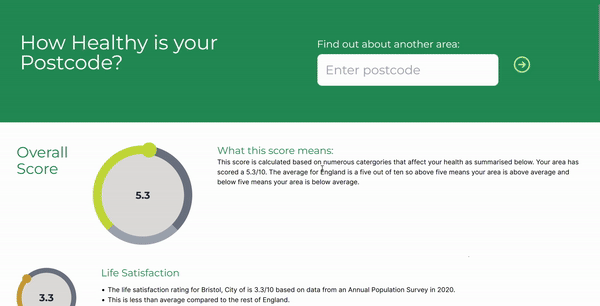
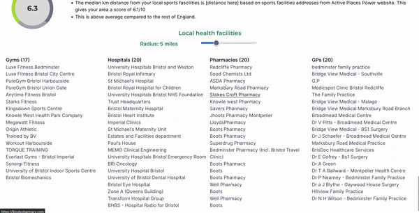

# How healthy is your Postcode?

<p align="center">


</p>

#### Our task was to create something to do with the topic of **_health_**.

We decided to create a web app which weights different UK postcodes based on collected data about the surrounding area.
This could be used by people who are moving house and comparing different places to live, or even just to see the score of your current location.

## Demonstration

Within the home page, the user is presented with a simple option to enter their postcode and upon submission, a loading page is displayed and the score is shown on a dial with a breakdown of individual categories.

<p align="center">

</p>

#### Note that the postcode entered is represented within the url of the page; e.g. https://example.com/postcode/BS13ONJ and postcodes can be queried through the url

From here, breakdown shows score dials for different categories as well as the previous years data on a graph.

<p align="center">

</p>

As additional functionality, we utilitse the Google Map API and display proximity to local health services such as gyms and gps.

<p align="center">

</p>
 
 ---

## Recreating this project

#### Prerequisites / What you need 
- Supabase database from ```dataWithCorrespondingLADCodes.xlsx``` 
- Google Maps API key


#### Steps

1. Clone the project
2. Add secrets to /webapp/health/.env
3. Run ```npm install```
4. Run ```npm run dev``` and navigate to http://localhost:3000

---

## Reflections

- This was our first project where we had no provided structure to follow. We struggled to initially come up with an idea and when we finally settled on this, set about trying to implement it.
- For most of us, this was the first time using typescript
    - As such we realised after the fact that the server side secrets would be accessible from the client side 
    - So we should have put more thought into the planning of the design of the solution
    - and so the solution cannot be put on a public domain
- Need to have a better solution for storing postcode -> LAD code
- We learned a lot about TS and JS as well as the amount of effort which goes into designing websites
    - Utilising tailwind really helped us customise the webpage


**Overall, we were happy with what we were able to produce for our first hackathon.**
